<h1 id="overview">Overview</h1>

---

Integrating with the Extend SDK will allow you to display offers and sell extended warranty contracts in your online store. This guide will walk you through how to do the following:

- <ins>[Set up your store with Extend](#setting-up)</ins>
- <ins>[Add the Extend SDK scripts](#installation)</ins>
- <ins>[Render Extend offer buttons on your product display page](#product-offers)</ins>
- <ins>[Add the Extend offer modal and add warranties to the cart](#modal-add-warranties)</ins>
- <ins>[Handle multiple product variants](#multiple-variants)</ins>
- <ins>[Add extended warranties to your cart](#cart-offers)</ins>
- <ins>[Cart normalization and quantity matching](#cart-normalization)</ins>
- <ins>[Support post-purchase warranty functionality](#post-purchase-offers)</ins>
- <ins>[ExtendShopify API reference](#api-reference)</ins>

**Before you start:** Make sure you have installed the Shopify Extend App. Visit <ins>[merchants.extend.com](https://merchants.extend.com/login)</ins> and login with your Shopify account.

<h1 id="setting-up">Set up your store with Extend</h1>

---

Before you start integrating with the Extend SDK you'll need to do the following:

- <ins>[Create a copy of your current theme](#copy-theme)</ins>
- <ins>[Get your `storeId`](#get-store-id)</ins>
- <ins>[Add the Extend SDK scripts](#installation)</ins>

<h3 id="copy-theme">Create a Copy of Your Current Theme</h3>

---

From the Shopify admin, go to **Online Store** → **Themes** → **Actions** → **Duplicate**

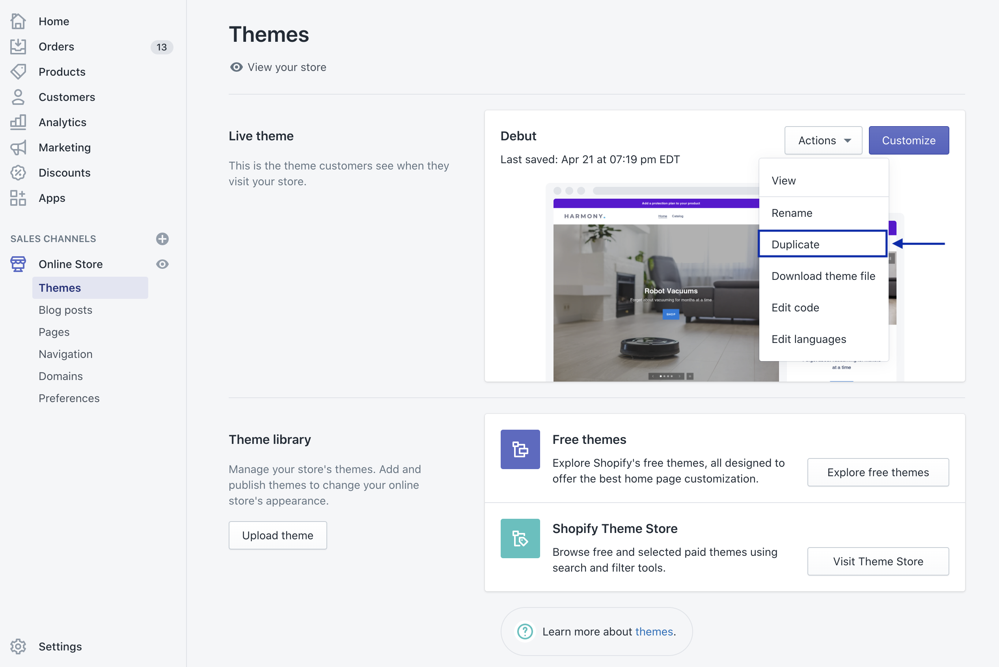

<div class="info-container">
    <strong>Important Note:</strong> Once you start the integration, you should treat this copied theme as your master copy. It is important to not make any changes to your live theme or publish a new theme, as those changes might interfere with the Extend integration.
</div>

<h3 id="get-store-id">Get your store ID</h3>

---

In order to configure the SDK to your store, you will need your Store ID.

Go to <ins>[merchants.extend.com](https://merchants.extend.com/login)</ins>→ **Settings** → **Production/Sandbox credentials**

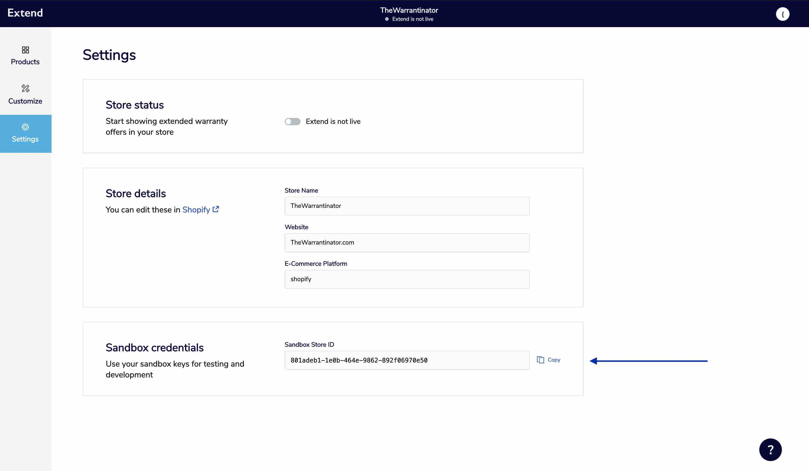

<h1 id="installation">Add the Extend SDK scripts</h1>

---

Add the following scripts into your **theme.liquid** file right before the closing `</head>` tag and press **save**.

```html
<script src="https://sdk.helloextend.com/extend-sdk-client/v1/extend-sdk-client.min.js"></script>
<script src="https://sdk.helloextend.com/extend-sdk-client-shopify-addon/v1/extend-sdk-client-shopify-addon.min.js"></script>
<script>
  Extend.config({ storeId: '<YOUR_EXTEND_STORE_ID>', environment: 'production' })
</script>
```

<div class="info-container">
    <strong>Important Note:</strong> If you installed the <strong>Extend Demo application</strong>, you will need to configure your store with the <strong>demo</strong> environment:
</div>

```html
<script>
  Extend.config({ storeId: '<YOUR_EXTEND_STORE_ID>', environment: 'demo' })
</script>
```

To verify the scripts are running correctly, **preview** your theme copy, open your browser's console, and type
**'Extend'** or **'ExtendShopify'** and hit enter. Both SDK's should appear in the console.


<h1 id="product-offers">Render Extend offer buttons on your product display page</h1>

---

The **Product Offer** is used to display one or more protection plan offers directly on the product page and is the shopper's first opportunity to add a warranty plan to the cart. Typically this will show 1-, 2-, and 3-year options for the same plan.

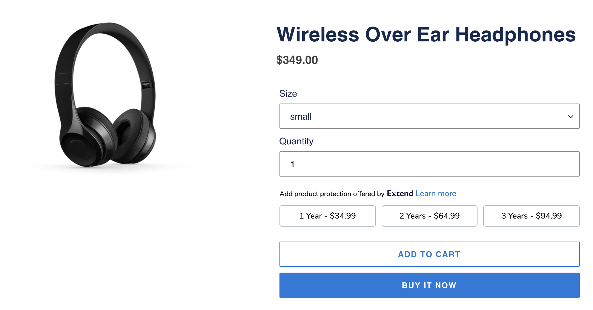

<div class="info-container">
    <strong>Important Note:</strong> Only products that are <strong>matched</strong> and <strong>active</strong> will display offers.
</div>

<h3 id="offer-element">Adding the Extend offer element</h3>

---

Add an HTML element where you would like to place the Extend offer buttons. For highest conversion rates, we recommend placing it directly above the Add to Cart button. In most cases, the button is in the **product-template.liquid**, **product.liquid**, or **product.form.liquid** file, but if you have done previous work on your product page the it may be located somewhere else in your theme.

```html
<div id="extend-offer">This is where the buttons will render</div>
```

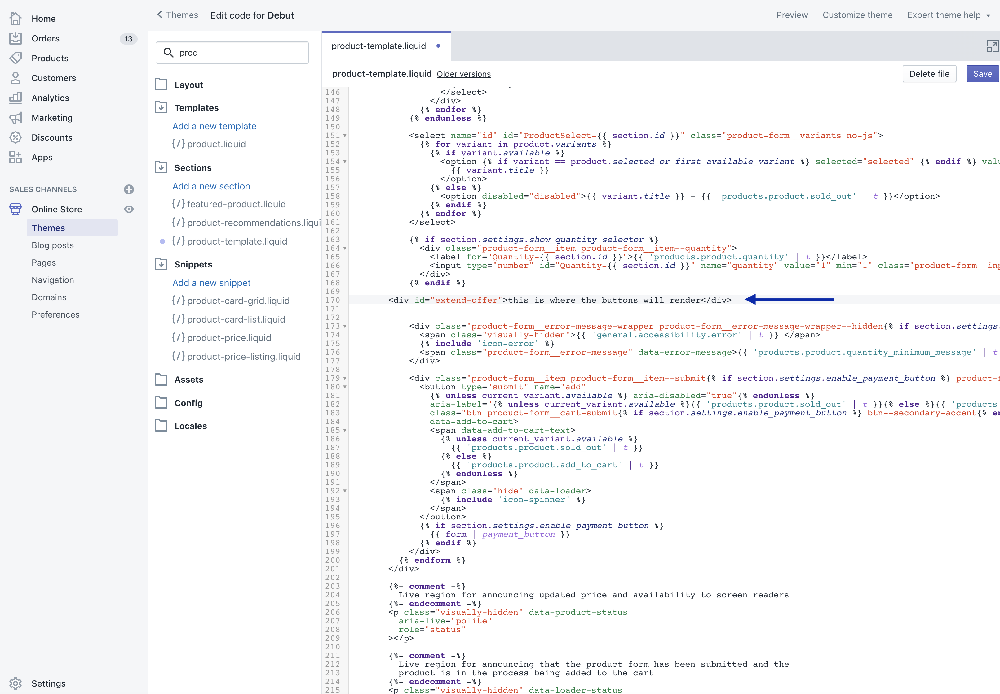

<div class="info-container">
    <strong>Important Note:</strong> An easy way to find where to place the parent div element is to open the dev tools on a product page and inspect an element above where you would like the cart offers to appear, copy an attribute, and search for it in one of the liquid files mentioned above.
</div>

Verify that the div has been added to the correct spot by temporarily adding some text, saving, and previewing your product page. Once you confirm that the text is showing in the correct spot, make sure to remove it!

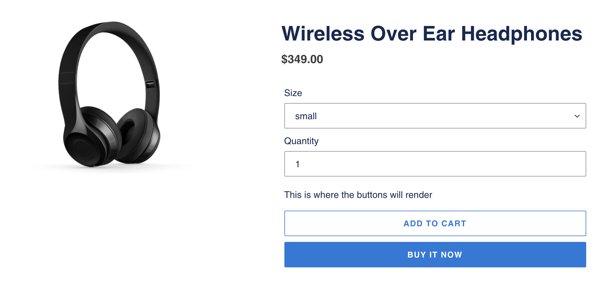

<h3 id="product-integration-snippet">Creating a custom product integration snippet</h3>

---

Inside your Shopify theme code editor create a new snippet called **extend-product-integration**. This is where you will leverage the Extend SDKs to display warranty offers on the product page that customers can add to their carts. As you will see, this file is effectively just a script that will be executed after your product display page is loaded.

**Themes** → **Snippets** → **Add a new snippet**

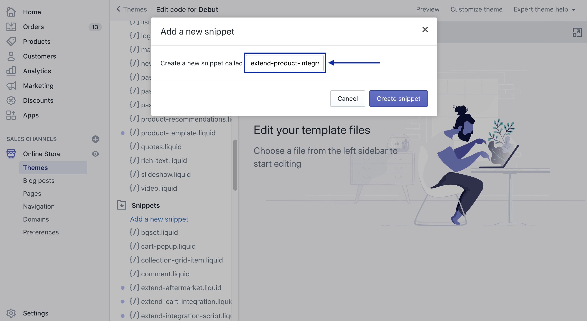

To ensure this snippet only runs when the Extend SDK is properly initialized, add the following code:

```html
<script>
  if (window.Extend && window.ExtendShopify) {
    // Integration code will go here
  }
</script>
```

Render the snippet on the same page you added the Extend product offer div by adding the following code to that page.

```raw

```

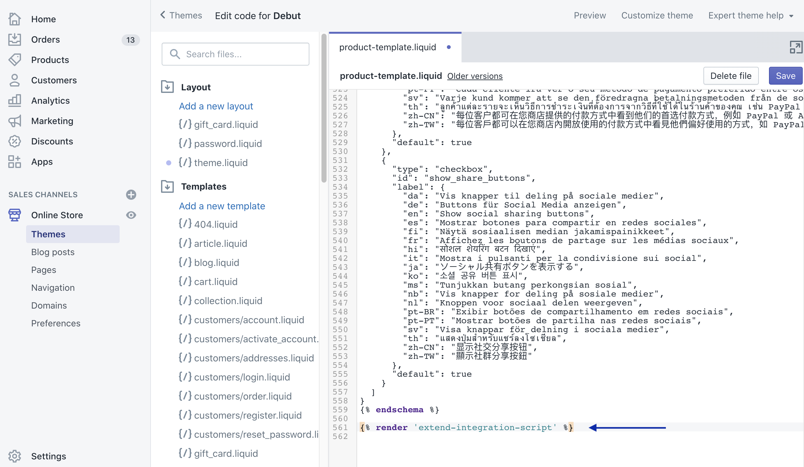

<h3 id="render-buttons">Rendering the Extend warranty offer buttons on the product page</h3>

---

Now that the snippet has been added, use the `Extend.buttons.render()` function to render the offer buttons on the product page. This function takes two arguments:

- The ID of [the element you added in the previous step](#offer-element) (likely `#extend-offer`)
- An object with a key of `referenceId` and a value of the selected product `variantId`

```javascript
// saves the selected variantId to a variable
var variantId =  {{ product.selected_or_first_available_variant.id }} 

// renders the Extend offer buttons for the product
Extend.buttons.render(
    '#extend-offer',
    { referenceId: variantId }
)
```

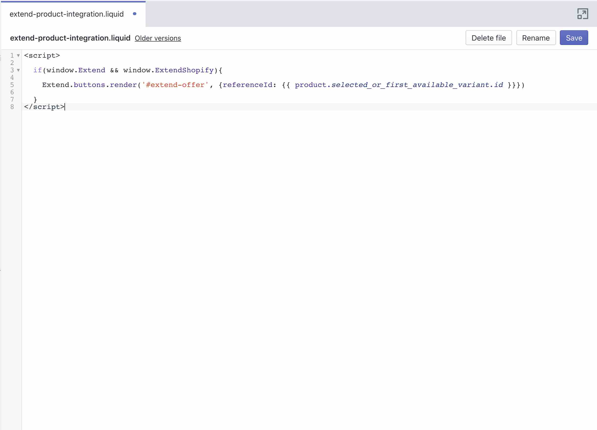

<div class="info-container">
    <strong>Important Note:</strong> <strong>{{ product.selected_or_first_available_variant.id }}</strong> allows you to get the first selected <strong>variantId</strong> when the page loads in your Shopify store, however, this variable <strong>does not update</strong> when a user changes the variant. The <a href="#multiple-variants">next section</a> covers how to handle this scenario.
</div>

Verify that the warranty buttons are rendering by previewing your theme and viewing a product that is active and enabled. If you don’t know a product that fits this criteria, you can find one in the merchant portal [<u>merchants.extend.com</u>](https://merchants.extend.com/login).


<div class="info-container">
    <div style="margin-bottom: 8px;">
        <strong style="color: #009926">
            <u>Troubleshooting</u>:
        </strong>
        If you are having trouble seeing the warranty buttons, please check the following:
    </div>
    <ul>
        <li style="margin-bottom: 4px;">Ensure are viewing a product that is <b>matched</b> and <b>active</b> </li>
        <li style="margin-bottom: 4px;">Verify that your store is <b>live</b> (check the merchant portal, at the top of your screen)</li>
        <li style="margin-bottom: 4px;">Verify that you are rendering the snippet on the page that contains offer div</li>
    </ul>
</div>

<h1 id="multiple-variants">Handle multiple product variants</h1>

---

In order to prevent a customer from accidentally purchasing the wrong warranty for a product, the warranty offers need to be updated every time a shopper selects a different variant for a product. This is done by passing the `variantId` of the newly selected product to the `Extend.setActiveProduct` function. Therefore, you will need to determine how your store updates the product page when a different product variant is selected. This is typically done by dispatching a JavaScript event or by manipulating the window location. Add an event listener to the page and invoke `Extend.setActiveProduct()` with the newly selected `variantId`.

```javascript
  Extend.setActiveProduct('#extend-offer', <VariantId>)
```

<div class="info-container">
    <strong>Important Note:</strong> A common way to find the event that fires when a product variant is changed is to look at the eventListeners tied to your product options selector.
</div>

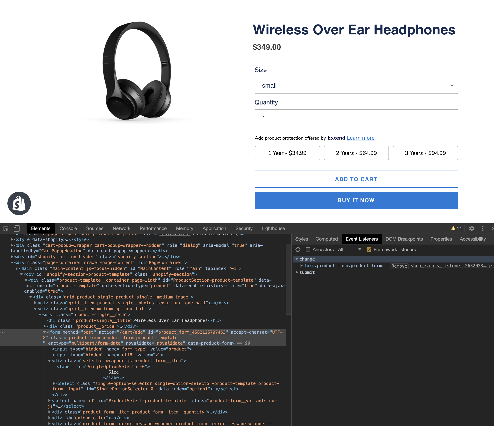

Verify that you are setting the correct variant by adding a console log right before the `Extend.setActiveProduct()` function is called. This ensures you are passing the correct `variantId`. You will also notice that if you change the variant on the page, the offer buttons will re-render.

<h3 id="examples">Examples</h3>

---

Variant IDs are not accessible in the same way across all Shopify themes, but below are two of the most common scenarios we have seen:

**Example 1**: `variantId` in the URL params

In the example below, the `variantId` is available in the URL when the product variant changes. To set the active variant, you need to grab the `variantId` from the URL and call `Extend.setActiveProduct()`.

```javascript
var productForm = document.querySelector('.product-form')

productForm.addEventListener('change', function() {
  var urlParams = new URLSearchParams(window.location.search)
  var variantId = urlParams.get('variant')
  if (variantId) {
    Extend.setActiveProduct('#extend-offer', variantId)
  }
})
```

If you plan on enabling support for customers who use Internet Explorer 11, the above code would need to be rewritten in the following way, since `URLSearchParams` would not be defined for them:

```javascript
var productForm = document.querySelector('.product-form')

function getSearchQueryParam(searchString) {
  // If user is on a modern browser, use its implementation of URLSearchParams
  if (window.URLSearchParams) {
    return new URLSearchParams(window.location.search).get(searchString)
  }

  var results = new RegExp('[?&]' + searchString + '=([^&#]*)').exec(window.location.search)
  if (results == null) {
    return null
  } else {
    return decodeURI(results[1]) || 0
  }
}

productForm.addEventListener('change', function() {
  var variantId = getSearchQueryParam('variant')
  if (variantId) {
    Extend.setActiveProduct('#extend-offer', variantId)
  }
})
```

<div class="info-container">
    <strong>Important Note:</strong> sometimes the `variantId` in the URL is only available when the variant changes (and not when you load the page for the first time). You can set the variantId with <strong>{{ product.selected_or_first_available_variant.id }}</strong> to cover this case.
</div>

**Example 2**: `variantId` in <strong>theme.js</strong> file

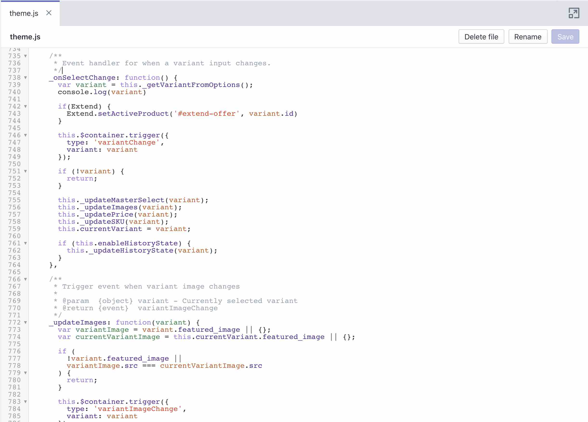

<div class="info-container">
    <strong>Important Note:</strong> The variant change function may be in your Assets folder or somewhere else in your Shopify theme.
</div>

<h1 id="modal-add-warranties">Add the Extend offer modal and add warranties to the cart</h1>

---

The **Modal Offer** is a modal rendered before navigating the customer to a new page and adding a product to cart, or as an opportunity on the cart page. In the example below, the offer modal appears after the customer added the product to the cart without selecting one of the offered protection plans.

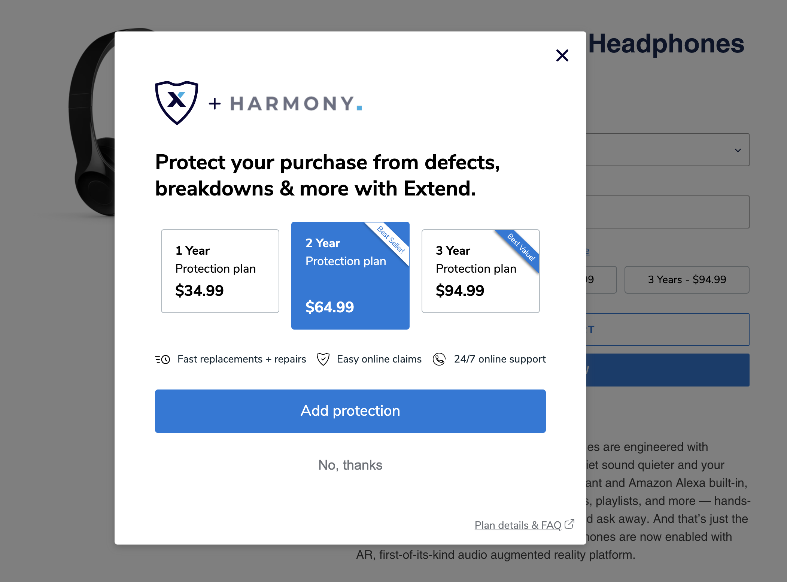

<h3 id="atc-event-listener">Add an eventListener to the Add to Cart button</h3>

---

Select the Add to Cart button element on the product page using vanillaJS or jQuery and add an eventListener.

```javascript
var addToCartButton = document.querySelector("button[name='add']")
```

```javascript
addToCartButton.addEventListener('click', function(e) {})
```

In order to add the warranty to the cart or launch the offer modal, you need to prevent the default behavior of the Add to Cart button. You can do this by adding an `event.preventDefault()` or `event.stopImmediatePropagation()` inside the eventListener.

```javascript
e.preventDefault()
```

or

```javascript
e.stopImmediatePropagation()
```

Inside the Add to Cart eventListener, add [`ExtendShopify.handleAddToCart()`](#api-handle-add-to-cart) function. Make sure to select `quantity` value from product form and add to [`ExtendShopify.handleAddToCart()`](#api-handle-add-to-cart) function.

```javascript
addToCartButton.addEventListener('click', function(e) {
  e.preventDefault()

  var quantityEl = document.querySelector('[name="quantity"]')
  var quantity = quantityEl && quantityEl.value

  ExtendShopify.handleAddToCart('#extend-offer', {
    quantity: quantity,
    modal: true,
    done: function() {
      // call function to add your product here
    },
  })
})
```

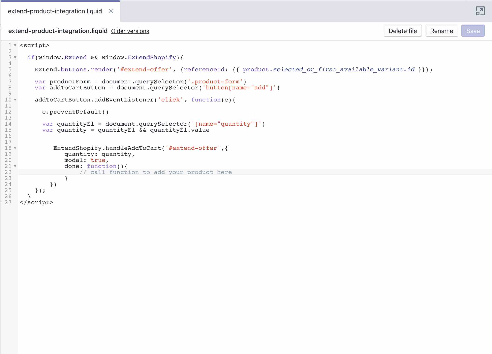

To launch the offer modal if a warranty is not selected, set `modal: true`. If you do not want to launch the offer modal, set `modal: false`.

<h3 id="resume-atc">Resume Add to Cart function</h3>

---

Once the warranty has been added to the cart or the shopper has decided to not add a warranty (from the offer modal), you need to resume the Add to Cart function so that the product gets added to the cart. Inside the `done` function, trigger your theme’s product form submit function. This can be done in a number of ways, so it is up to you to determine the best solution for your theme.

**Standard Add to Cart flow (i.e form submission):**

```javascript
// select the form where the Add to Cart button is in.
var productForm = document.querySelector('.product-form')

// call the submit method on the form element to trigger the form submission
productForm.submit()
```

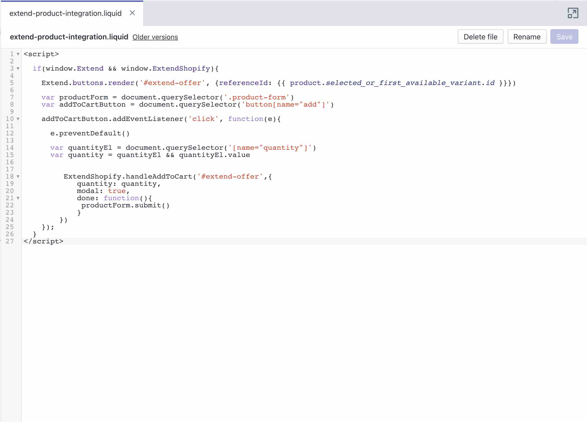

<h1 id="cart-offers">Add extended warranties to your cart</h1>

---

The cart offer is the last chance your shoppers have to add an extended warranty before they checkout. Here you can display an offer button next to each eligible product in the cart that does not already have a protection plan associated with it.

**Cart offer example**:

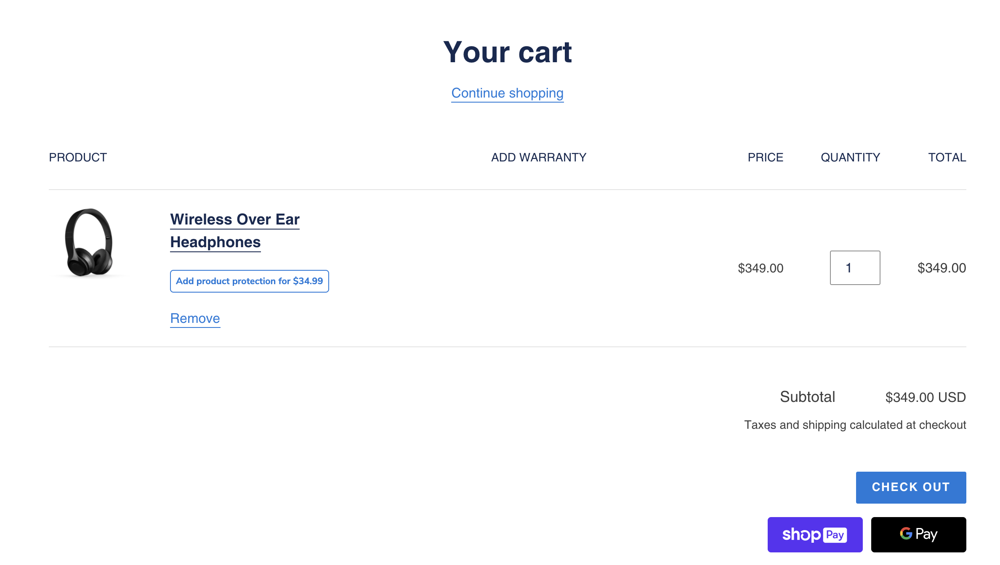

<h3 id="cart-offer-element">Add the Extend cart offer element</h3>

---

Add an HTML element where you would like to place the Extend cart offer buttons. We recommend placing the element directly below each product in the cart. In most cases, that is in the **cart.liquid** or the **cart-template.liquid** file.

You need to add this button under each product in the cart that does not have a warranty. Find where the cart items are being iterated on in the template. Then set the `quantity` and `variantId` of the product to the cart offer div data attributes:

```html
<div
  id="extend-cart-offer"
  data-extend-variant="{{ item.variant.id }}"
  data-extend-quantity="{{ item.quantity }}"
></div>
```

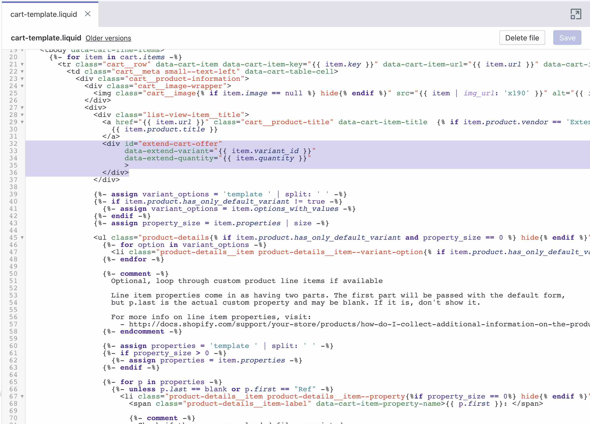

Verify that the div has been added to the correct spot by temporarily adding some text, saving, and previewing your cart page. Once you confirm that the text is showing in the correct spot, make sure to remove it!

You also need to verify that the `quantity` and `variantId` are being passed into the cart offer div correctly. In your preview, navigate to your cart and inspect the page. You won’t be able to see the Extend cart offer buttons on the page, but you should see the HTML element.

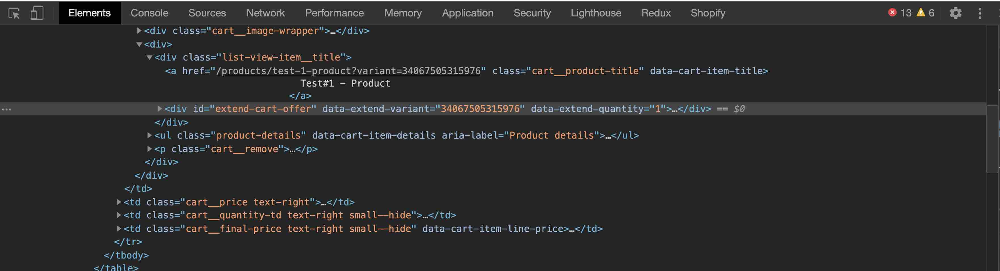

<h3 id="cart-integration-snippet">Create custom cart integration snippet</h3>

Inside your Shopify theme code editor create a new snippet called **extend-cart-integration**. This is where you will call the Extend APIs to handle adding warranties to the cart.

**Themes** → **Snippets** → **Add a new snippet**

Render the snippet in the template where you added your Extend cart offer div (likely your cart page template file).

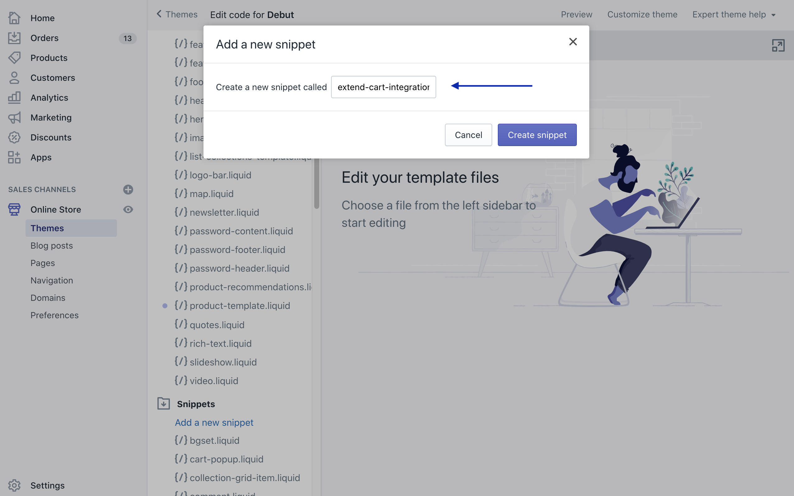

To ensure this snippet only runs when the Extend SDK is properly initialized, add the following code:

```html
<script>
  if (window.Extend && window.ExtendShopify) {
    // cart integration code goes here
  }
</script>
```

<div id="helper-functions" style="margin-bottom: 12px;">
    Add two helper functions: <code>findAll</code> and <code>hardRefresh</code>. <code>findAll</code> will be used to select all of the cart offer divs on cart page. <code>hardRefesh</code> ensures we do not run into any HTML caching issues when your cart page is refreshed after updates the cart have been detected.
</div>

```javascript
var slice = Array.prototype.slice

function findAll(element) {
  var items = document.querySelectorAll(element)
  return items ? slice.call(items, 0) : []
}

function hardRefresh() {
  location.href = location.hash
    ? location.href.substring(0, location.href.indexOf('#'))
    : location.href
}
```

<div id="hard-refresh-note" class="info-container">

<strong>Important Note:</strong> By using <a href="#helper-functions"><code>hardRefresh</code></a> we guarantee that all cart line item quantity updates are always reflected in the DOM across all browsers. As you will see below, this function will be invoked after adding a plan to the cart via a cart offer and after cart normalization updates have been made to the cart.

</div>

<i><strong>Gotcha:</strong> In order to hard refresh appropriately across all browsers, we need to use location.href = location.href, which does not work if there is a hash tag # in the URL. The hardRefresh function above safely strips hash tags from the URL. This means when the page reloads, the user will always land at the top of the page.</i>

<h3 id="render-cart-offer-buttons">Render cart offer buttons</h3>

Call the `findAll` helper method we added in the last step to find all the Extend cart offer divs. Here you need to pass in the ID of the Extend cart offer element (`#extend-cart-offer`).

As you iterate through each item, pull out the `variantId` and the `quantity` from the **#extend-cart-offer** div data attributes.

```javascript
var variantId = el.getAttribute('data-extend-variant')
var quantity = el.getAttribute('data-extend-quantity')
```

Use the [`warrantyAlreadyInCart()`](#api-warranty-already-in-cart) function to determine if you should show the offer button.

You can access the Shopify cart object by declaring this variable at the top of your page:

```liquid
var cart = {{ cart | json }}
```

```javascript
if (ExtendShopify.warrantyAlreadyInCart(variantId, cart.items)) {
  return
}
```

Then render the cart offer buttons using the `Extend.buttons.renderSimpleOffer()` function.

```javascript
Extend.buttons.renderSimpleOffer(el, {
  referenceId: variantId,
  onAddToCart: function(options) {
    ExtendShopify.addPlanToCart(
      {
        plan: options.plan,
        product: options.product,
        quantity: quantity,
      },
      function(err) {
        // an error occurred
        if (err) {
          return
        } else {
          // Effectively hard reloads the page; thus updating the cart
          hardRefresh()
          // For ajax carts invoke your cart refresh function
        }
      },
    )
  },
})
```

[`ExtendShopify.addPlanToCart`](#api-add-plan-to-cart) also takes a callback that can be used to refresh the cart to reflect the recently added warranty.

```javascript
function (err) {
  // an error occurred
  if (err) {
    return
  } else {
    // Effectively hard reloads the page; thus updating the cart
    hardRefresh()
  }
}
```


Verify the cart offer buttons are rendering correctly by previewing your theme and going to your cart page that has an active and enabled product in it. You should see the Extend cart offer button in the cart, and when you click it, it should launch the offer modal. When a shopper clicks this offer button, the modal described in the previous section will launch, and the shopper will be able to select which warranty plan he or she would like to purchase.


<h1 id="cart-normalization">Cart normalization and quantity matching</h1>

---

As part of the checkout process, customers often update product quantities in their cart. The cart normalization feature will automatically adjust the quantity of Extend protection plans as the customer adjusts the quantity of the associated product. If a customer increases or decreases the quantity of products, the quantity for the related warranties in the cart should increase or decrease as well. In addition, if a customer has completely removed a product from the cart, any related warranties should be removed from the cart so the customer does not accidentally purchase a protection plan without a product.

To leverage cart normalization, you need to add the Extend normalize function to the cart integration script. First add the `cart` variable:

```liquid
var cart = {{ cart | json }}
```

Then add the [`ExtendShopify.normalizeCart`](#api-normalize-cart) function and pass the Shopify Cart object to it:

```javascript
ExtendShopify.normalizeCart({ cart: cart, balance: false }, function(err, data) {
  if (data && data.updates) {
    // Effectively hard reloads the page; thus updating the cart
    hardRefresh()
  }
})
```

[`ExtendShopify.normalizeCart`](#api-normalize-cart) will return a promise that will give you the `data` and `err` object to check if the cart needs to be normalized. If the `data` object exists and the `data.updates` is set to `true`, you will then call your function to refresh the cart page. Typically reloading the page will work for most Shopify cart pages.

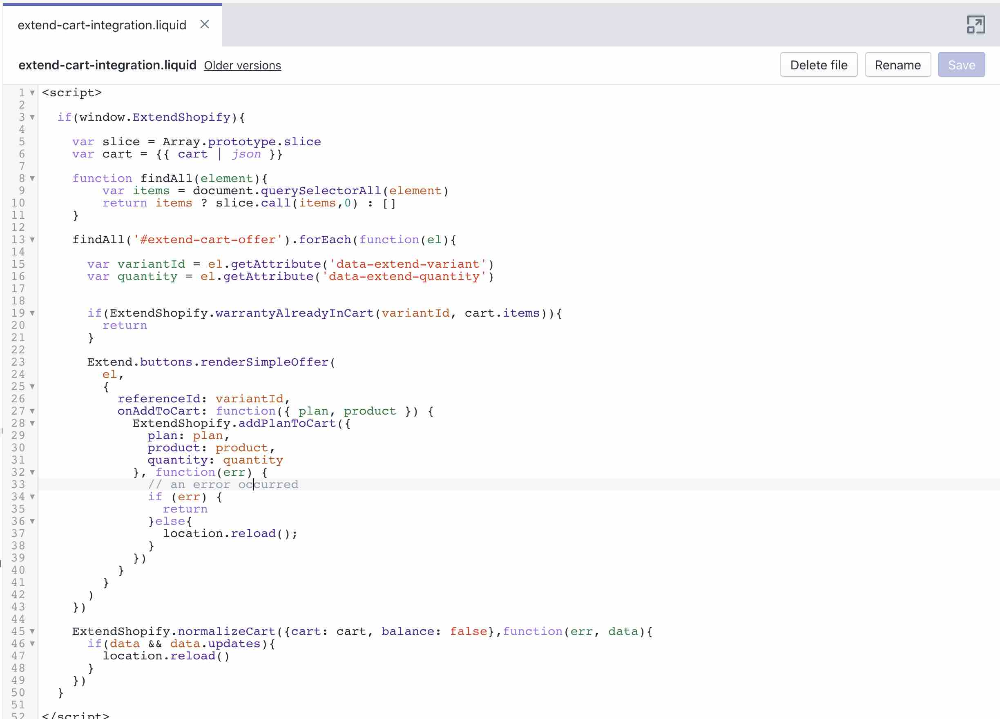

<h3 id="cart-balance">Balanced vs unbalanced carts</h3>

Now that you have the normalize function in place, you need to decide if you want a **balanced** or **unbalanced** cart.

- **Balanced cart**: Whenever the quantity of a product with a warranty associated with it is increased, the quantity of the extended warranty sku associated with it will also increase to match.
- **Unbalanced cart**: Whenever the quantity of a product with a warranty associated with it is increased, the quantity of the extended warranty sku will remain the same, and it is up to the shopper to decide if he or she wants to add warranties to protect those new products.

Balanced and unbalanced carts can be toggled with the `balance: true/false` property

<h3 id="ajax-normalization">Ajax cart normalization</h3>

**Not using an AJAX cart?** Feel free to skip ahead to the <a href="#styling" >Styling</a> section.

If you are using an Ajax cart, the page does not reload whenever an item’s quantity is updated. This means that in order to normalize an Ajax cart, you need to identify when the quantity of an item changes and then run the [`ExtendShopify.normalizeCart`](#api-normalize-cart) function. Typically, changing the quantity of the items in the cart will trigger a function that will make an API call to Shopify to update the cart. You need to get this new updated Shopify cart object and pass it into the [`ExtendShopify.normalizeCart`](#api-normalize-cart) function.

Define the cart integration code in a function, and then call that function at the bottom of your script. In this example, we defined the function to be called `initializeCartOffer`:

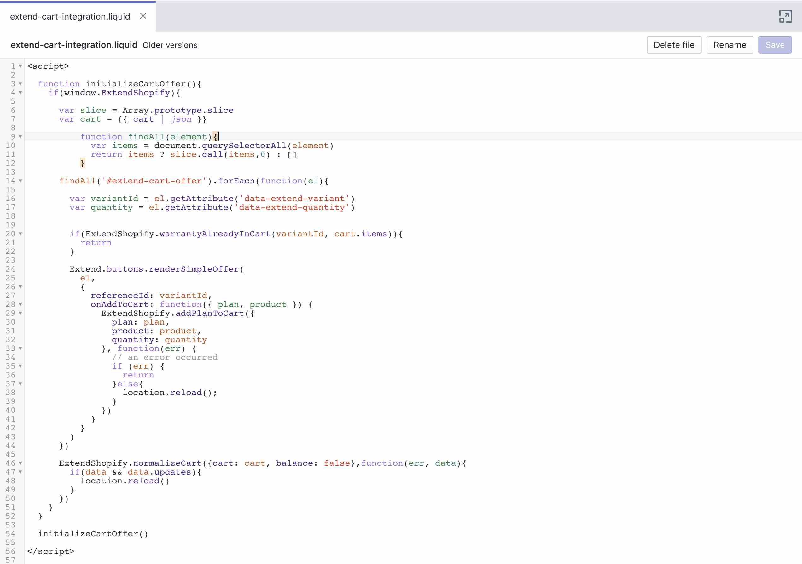

Now dispatch an event whenever an item in the cart gets updated. To do this, first add an eventListener in your cart integration script.

Inside the eventListener do the following:

- Make an API call to Shopify to get the most updated cart object
- Reassign the cart variable to the `newCart` object you get from the callback of the API call
- Call the function where you wrapped your Extend cart integration script in

```javascript
window.addEventListener('normalizeCart', function() {
  $.getJSON('/cart.js', function(newCart) {
    cart = newCart
    initializeCartOffer()
  })
})
```

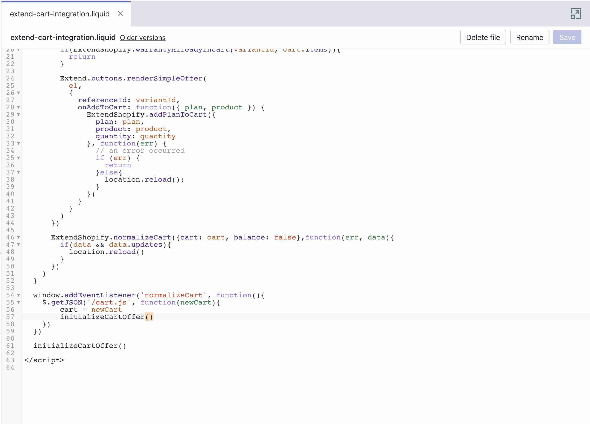

Now that you have the eventListener initialized, you need to find where in your code to dispatch a custom event. Find where in your Shopify theme the quantity of a cart item is updated and dispatch an event back to the cart integration script to pull in the new Shopify cart object.

**Example:**
In the example below, the quantity of a cart item is being updated from the `updateCart()` function in the site.js file:

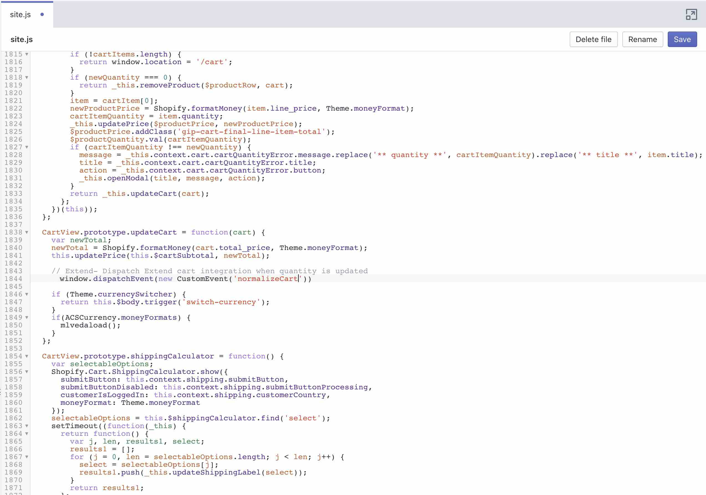

<a name="ajax-add-to-cart"></a>

<h1 id="ajax-side-cart">Ajax Side Cart Integration</h1>

---

Ajax side-carts are quite common, and the integration is similar to that of a regular Ajax cart.

<div style="display: flex; width:800px;" >
  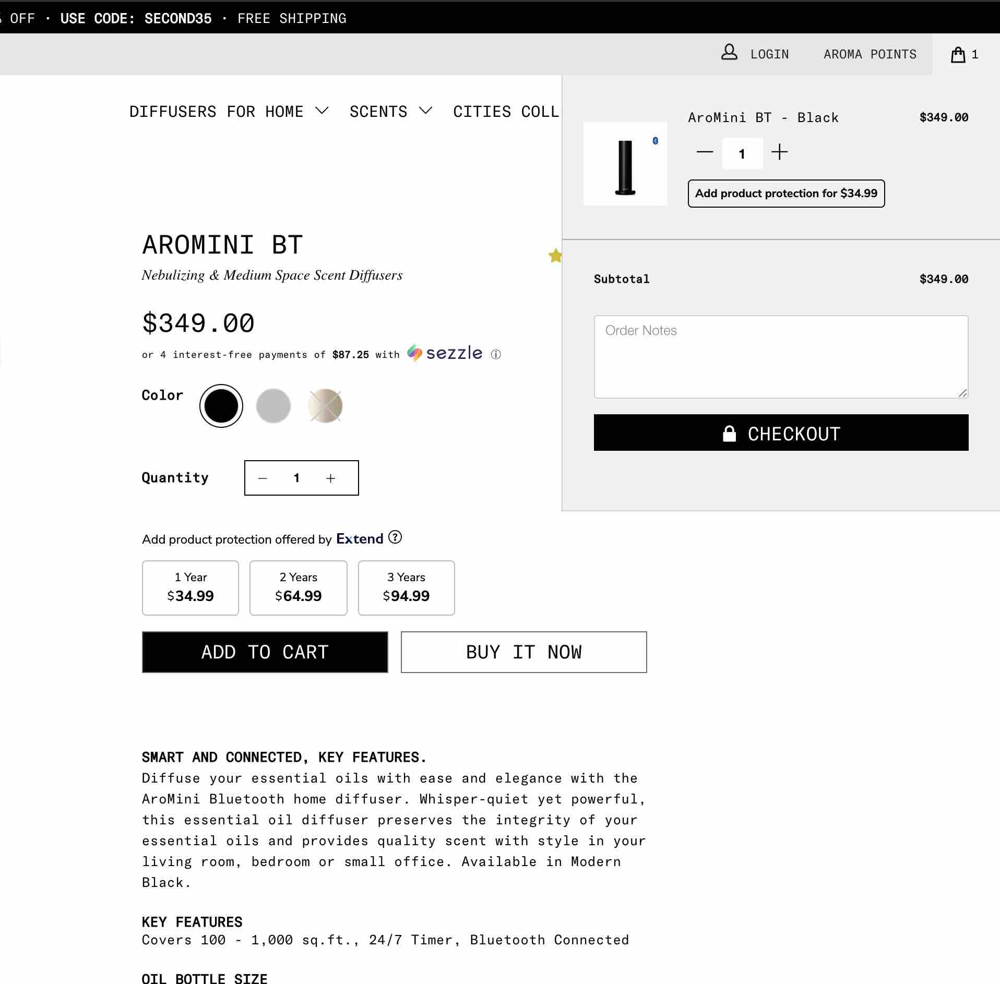
  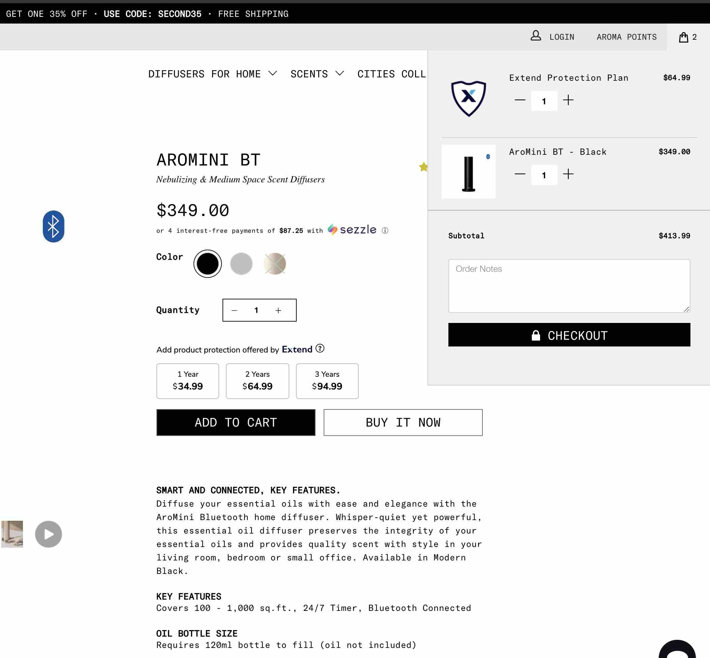
</div>

<h3 id="ajax-cart-offer-element">Add the Extend cart offer element</h3>

---

Add an HTML element where you would like to place the Extend cart offer buttons. We recommend placing it directly below each product in the cart. Typically this can be found in the **ajax-cart-template.liquid** file or in another similar template file.

You need to add this element under each product in the cart that does not have a warranty. Find where the cart items are being iterated on in the template. Then set the `quantity` and `variantId` of the product to the cart offer div data attributes:

```html
<div
  id="extend-cart-offer"
  data-extend-variant="{{ variantId }}"
  data-extend-quantity="{{ itemQty }}"
></div>
```

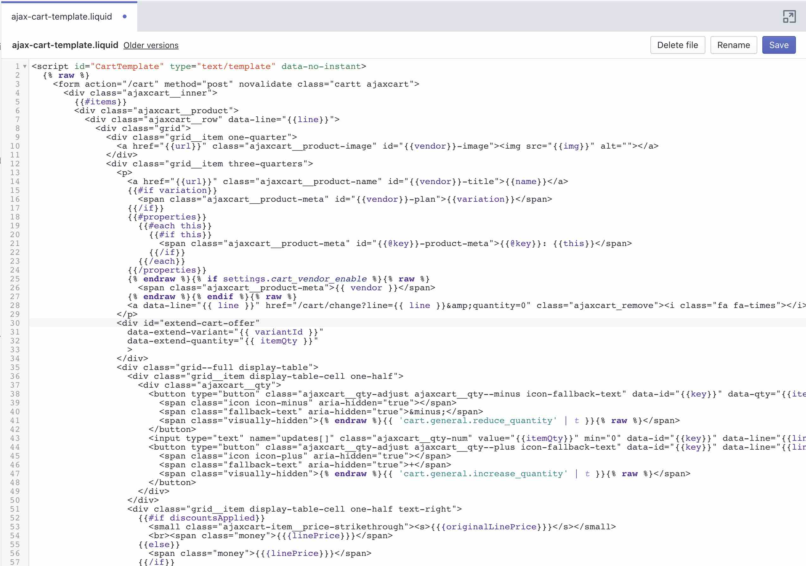

<h3 id="ajax-cart-integration-snippet">Create custom ajax side-cart integration snippet</h3>

---

Inside your Shopify theme code editor create a new snippet called **extend-ajax-side-cart-integration**. This is where you will call the Extend APIs to handle displaying offers on the product page and adding the warranties to the cart.

**Themes** → **Snippets** → **Add a new snippet**

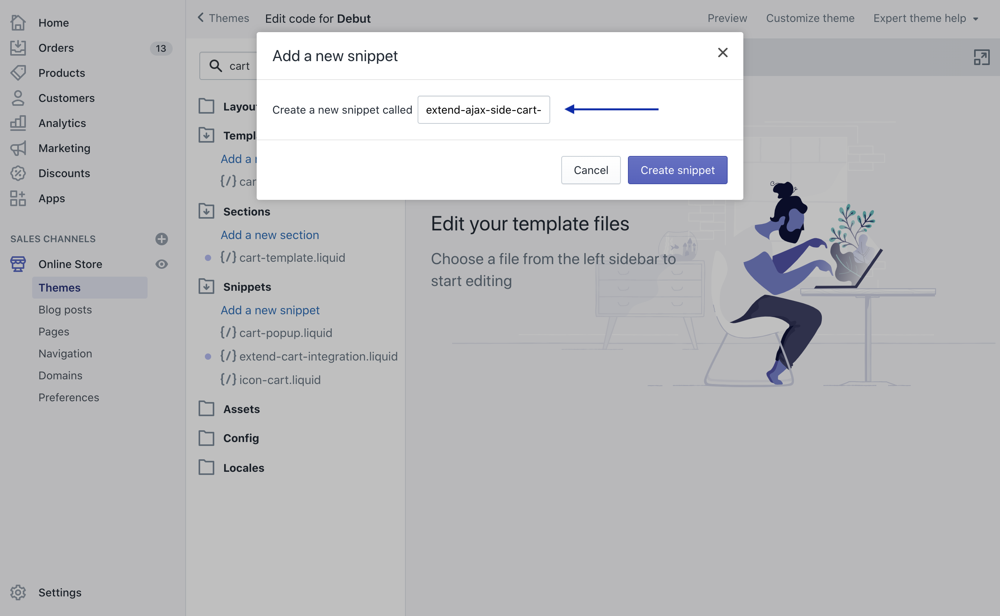

<h3 id="ajax-render-cart-offer-buttons">Render ajax side-cart offer buttons</h3>

---

Copy the code from the **extend-cart-integration** snippet that you created and paste it into the **extend-ajax-side-cart-integration** snippet. This will render the cart offer buttons in your ajax-side cart.

Then add an eventListener to dispatch events from your **themes.js** file. This will help rerun the script whenever a product is added or the cart needs to be normalized.

```javascript
window.addEventListener('refreshSideCart', function() {
  $.getJSON('/cart.js', function(newCart) {
    cart = newCart
    initializeCartOffer()
  })
})
```

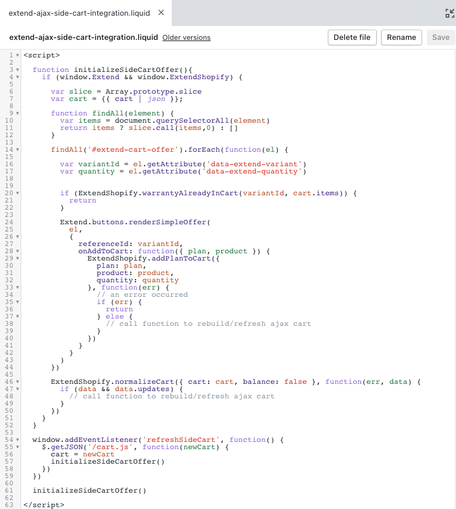

<h3 id="ajax-add-warranty">Adding a warranty from an ajax side-cart</h3>

---

Whenever an extended warranty is added from the ajax side-cart, you need to rebuild your ajax side-cart with the new Shopify cart object as well as call the **ajax-side-cart-integration** script. This will add the warranty to the cart as well as remove the cart offer button from the product in your side-cart.

<div class="info-container">
    <strong>Important Note:</strong> You can add the eventListener to the <strong>ajax-side-cart-integration</strong> script and dispatch custom events from your theme’s javascript file. This will allow you to rerun the snippet whenever a products quantity is changed or if the product is removed.
</div>

```javascript
window.dispatchEvent(new CustomEvent('cartItemUpdated'))
```

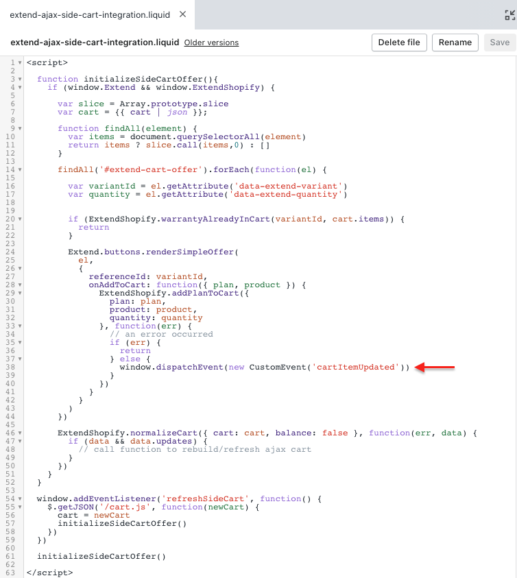

If you plan on enabling support for customers who use Internet Explorer 11, the above code would need to be rewritten in the following way, since `CustomEvent` would not be defined for them:

```javascript
function createCustomEvent(eventName, params) {
  // If user is on a modern browser, use its implementation of CustomEvent
  if (window.CustomEvent) {
    return new CustomEvent(eventName, params)
  }

  var options = params || { bubbles: false, cancelable: false, detail: null }
  var evt = document.createEvent('CustomEvent')
  evt.initCustomEvent(event, options.bubbles, options.cancelable, options.detail)
  return evt
}

window.dispatchEvent(createCustomEvent('cartItemUpdated'))
```

In the example below we add our eventListener to allow us to run the function that builds the ajax side-cart. This eventListener will be ran from the custom dispatched event we sent in the previous example.

```javascript
window.addEventListener('cartItemUpdated', function() {
  Extend.buttons.instance('#extend-cart-offer').destroy()

  $.getJSON('/cart.js', function(cart) {
    cartUpdateCallback(cart)
  })
})
```

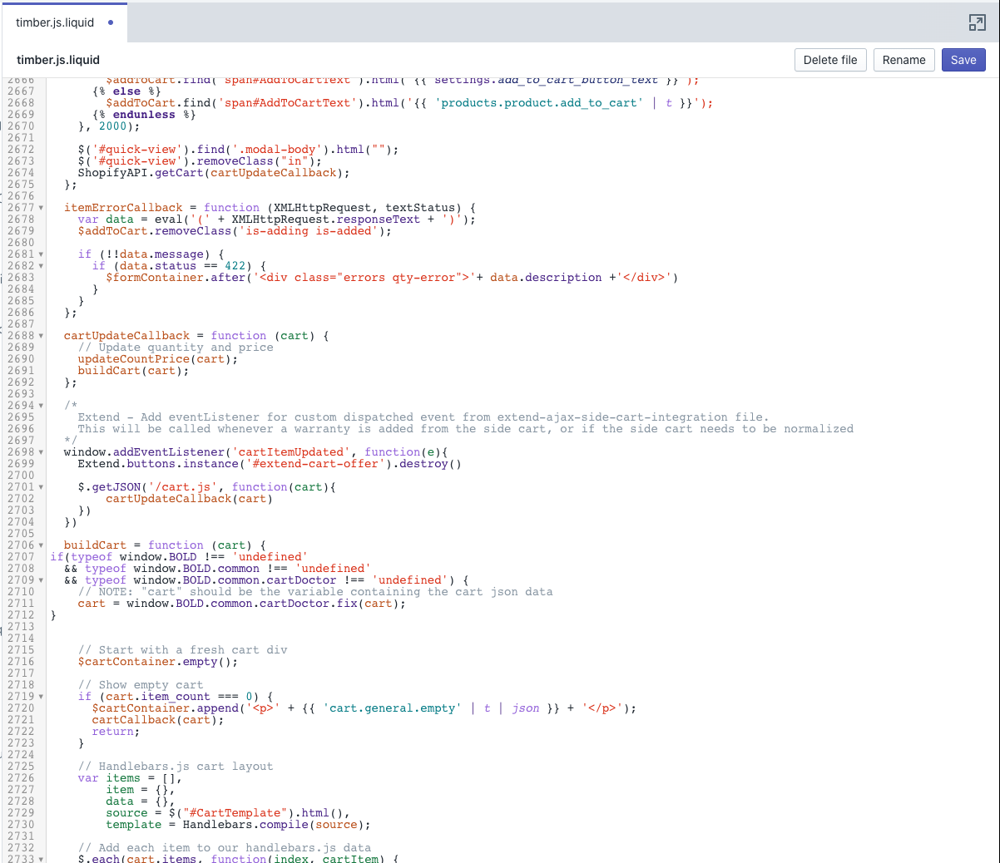

Once the ajax side-cart is rebuilt, you may also need to dispatch an event back to the <strong>ajax-side-cart-integration</strong> snippet to allow for the script to be run again.

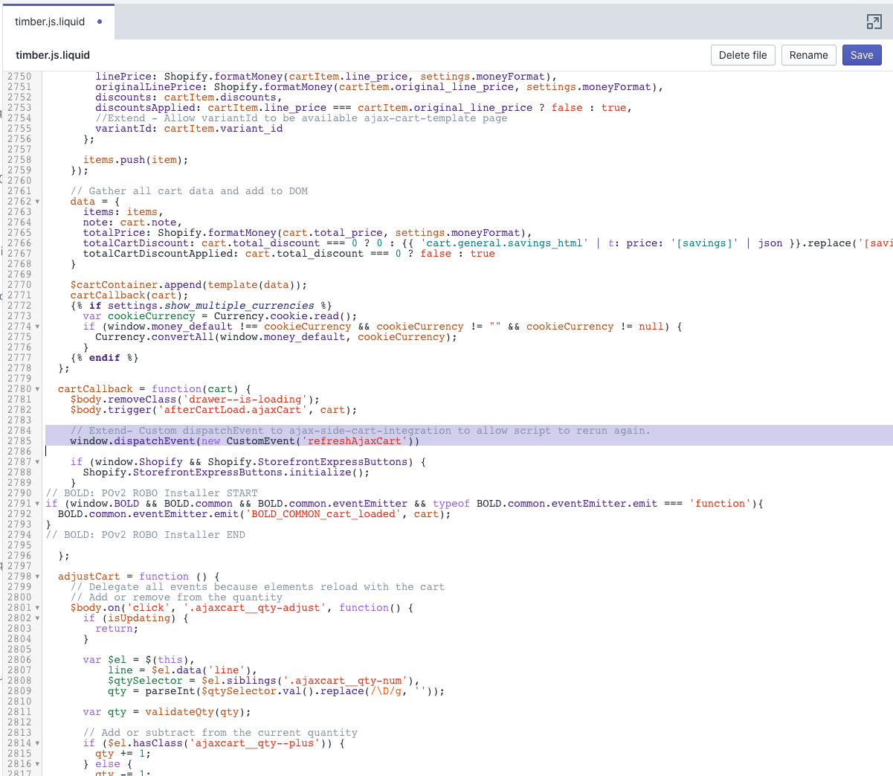

<h3 id="ajax-cart-normalization">Ajax side-cart normalization</h3>

---

In order to normalize the ajax side‐cart, find where in your theme the ajax side-cart is rebuilt/updated when the quantity of a product is changed and dispatch a custom event to the same eventListener that was setup in your <strong>ajax-side‐cart-integration</strong> snippet.

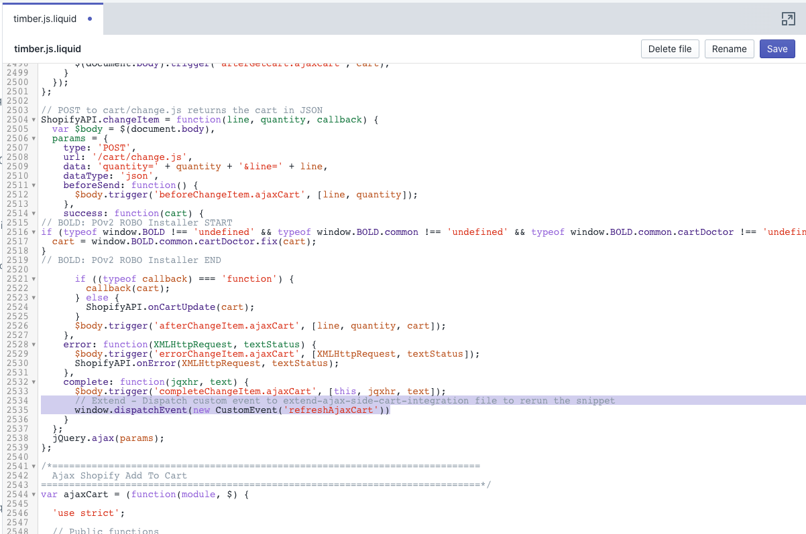

**Example:**

Once our script is rerun and we determine we need to normalize the cart, we will dispatch an event to the **extend-side-cart-integration** file to allow for the ajax side-cart to be rebuilt/refreshed with the new Shopify cart object.
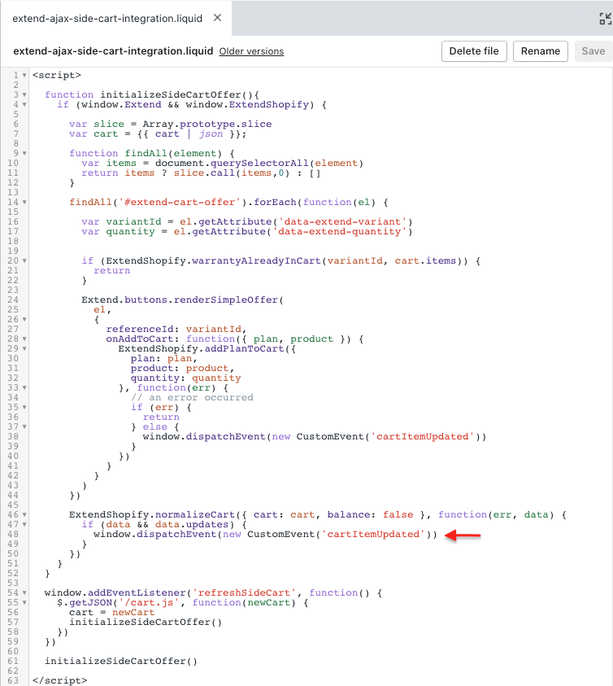

<h1 id="styling">Styling the Warranty in the Cart</h1>

Most cart templates will iterate through a product's details and display them on the cart page. They will also link to the product's page from the thumbnail image and from the product title. In the case of the warranty, we recommend hiding the meta-data and disabling the links to the warranty product page so a customer cannot purchase a warranty without a matching product.

<h3 id="disable-links">Disabling Links to Warranty Product Page</h3>

---

First, make sure you have an Extend warranty added to your cart. Next, navigate to the file where cart items are created. Typically, this will be the `cart-template.liquid` file. Within the file, find the line of code that iterates through the items in the cart.



```javascript

```



or



```javascript

```



<div class="info-container">
    <strong>Important Note:</strong> Sometimes you will have a separate file for the individual cart items. In that case, you will want to make changes to that file.
</div>

Within that for loop, find the elements where `class=item-image` and `class=item-title`. The class names might be slightly different, i.e. they may have `cart-` prepended. Within the opening tags of **both** of those elements, add the following line of code:



```javascript
 style="pointer-events: none;" 
```



Or, if the element is referred to as a `line_item`:



```javascript
 style="pointer-events: none;" 
```



This will conditionally disable the links on the warranty's thumbnail image and its title. Reload the page and ensure the links are disabled!

<h3 id="hide-warranty-meta-data">Hiding Warranty Meta-Data</h3>

---

Within the same file, typically below the `item-title` element, you'll see a section of code that iterates through the product's `options`. That will look something like the following (depending on how the individual cart items are named):



```javascript

```



Above that line, there will be an conditional to check whether the product options should be displayed. Often it will look lik e the following:



```javascript
{% unless line_item.variant.title contains 'Default'}
```



Add an `or` statement to the conditional to check whether it's an Extend warranty:



```javascript

```



Finally, you'll see a section of code that lists the products properties. Look for an element with a class name that starts with `product-details`. Within the opening tag of that element, you'll see a conditional that looks something like the following:



```javascript
 hide
```



Add `or` statements to the conditional to check whether the property is of type `Ref`, `Extend.LeadToken` or `Extend.LeadQuantity`:



```javascript
 hide
```



The final product should look something like the following:



```html
<tbody>
  
  <tr class="cart-item" data-id="{{ line_item.id }}">
    <td class="image">
      <div
            class="item-image"
            style="pointer-events: none;" 
            >
        <a href="{{ line_item.url }}">
          
        </a>
      </div>
    </td>
    <td class="item-name">
      <div
            class="item-title"
             style="pointer-events: none;" 
            >
        <a href="{{ line_item.url }}">
          <span class="item-name">{{ line_item.product.title }}</span>
        </a>
        
          <div class="wrap-item-variant">
            
              <span class="item-variant">{{ option }}: <span class="variant-title">{{ line_item.variant.options[forloop.index0] }}</span></span>
            
          </div>
          
          
          
          
          
        <li class="product-details__item product-details__item--property  hide" data-cart-item-property>
        <!-- NO FURTHER EDITS TO THIS SECTION OF CODE NEEDED -->
      </div>
    </td>
  </tr>
</tbody>
```



That's it! Give your page a refresh and ensure you can no longer see the warranty Reference Number and Title.

<h1 id="post-purchase-offers">Support post-purchase warranty functionality</h1>

---

Extend provides a way for merchants to offer customers protection plans for products they have already purchased. In order to display post-purchase warranties to customers, they need to be added as _leads_. To learn more about creating leads, check out our documentation <a href="https://docs.google.com/document/d/1S7vOuY7TeyIbuzCoE_T2mAmmBQ2_9mOuxppbOKyn230/edit?usp=sharing">here</a>. Once you have created leads, you can enable post-purchase offers in your store by following these two steps:

First, create a new snippet with the following title: `extend-aftermarket-integration`.

Within that snippet, copy and paste the following code:

```html
<script>
  if (window.Extend && window.ExtendShopify) {
    function getQueryParam(name) {
      var results = new RegExp('[\?&]' + name + '=([^&#]*)').exec(window.location.href)
      if (results == null) {
        return null
      }
      return decodeURI(results[1]) || 0
    }

    var leadToken = getQueryParam('leadtoken')
    if (leadToken) {
      Extend.aftermarketModal.open({
        leadToken: leadToken,
        onClose: function(plan, product, quantity) {
          if (plan && product) {
            ExtendShopify.addPlanToCart(
              { plan: plan, product: product, leadToken: leadToken, quantity: quantity },
              function() {
                // You can insert a custom callback if you don't want to redirect to the cart page
                window.location = '/cart'
              },
            )
          }
        },
      })
    }
  }
</script>
```

Next, in your `theme.liquid` file, add the following line of code before the closing `<head>` tag:



```javascript

```



That's it! You have enabled post-purchase offers for customers added as leads.

<h3 id="final-review">Final review</h3>

Congratulations, you have finished integrating the Extend Client SDK into your store! Before you publish your theme and start selling extended warranties, please make sure to go through the integration checklist, which you can find <a href="assets/files/integration-checklist.pdf" target="_blank">here</a>.

---

<h1 id="api-reference">ExtendShopify API reference</h1>

---

<h3 id="api-introduction">Introduction</h3>
Welcome to the `ExtendShopify` API reference! We're happy that you've decided to partner with us and leverage our Shopify SDK. This reference details the functions available to you via the `ExtendShopify` SDK interface and should be used in conjunction with our [`Extend Shopify Integration Guide`](#overview). If you haven't already done so, be sure to [create your store](#setting-up) and [add the Extend base SDK and Extend Shopify SDK scripts](#installation) to your store's `theme.liquid` file.

<h3 id="api-table-of-contents">Table of Contents</h3>
* [Add plan to cart (`#addPlanToCart`)](#api-add-plan-to-cart)
* [Normalize cart(`#normalizeCart`)](#api-normalize-cart)
* [Handle Add to Cart(`#handleAddToCart`)](#api-handle-add-to-cart)
* [Warranty already in cart(`#warrantyAlreadyInCart`)](#api-warranty-already-in-cart)

<h1 id="api-add-plan-to-cart">
    ExtendShopify.addPlanToCart(options: AddToCartOptions, callback: function)
</h1>

---

This function adds an Extend warranty plan to the cart. However, it should only be used within a callback that is provided to an [Extend base SDK]('https://helloextend.github.io/extend-sdk-client/') function that returns an Extend Plan and Product. **Important Note:** If you are looking to add a product _**and**_ its associated warranty to the cart, please see [`#handleAddToCart`](#api-handle-add-to-cart) instead.

```javascript
ExtendShopify.addPlanToCart({ plan, product, quantity }, callback)
```

<div class="info-container">
    <strong>Example use case:</strong>
    <a href="#render-cart-offer-buttons">
        <code>Extend.buttons.renderSimpleOffer</code>
    </a>
    and
    <a href="#post-purchase-offers">
        <code>Extend.aftermarketModal.open</code>
    </a>
</div>

<h3 id="add-plan-to-cart-attributes">Attributes</h3>

| Attribute                             | Data type | Description                                                                 |
| :------------------------------------ | :-------- | :-------------------------------------------------------------------------- |
| addToCartOptions <br/> _**required**_ | object    | [AddToCartOptions](#add-to-cart-options-attributes)                         |
| callback <br/> _optional_             | function  | Callback function that will be executed after the item is added to the cart |

<h3 id="add-to-cart-options-attributes">AddToCartOptions Object</h3>

| Attribute                    | Data type | Description                                                  |
| :--------------------------- | :-------- | :----------------------------------------------------------- |
| plan <br/> _**required**_    | object    | Extend plan object to be added to the cart                   |
| product <br/> _**required**_ | object    | Product associated with the warranty plan                    |
| quantity <br/> _optional_    | number    | Number of plans to be added to the cart (defaults to one)    |
| leadToken <br/> _optional_   | string    | Token used for [post purchase offers](#post-purchase-offers) |

<h3 class="api-interface">Interfaces</h3>

```typescript
interface addPlanToCartProps {
  opts: AddToCartOpts
  callback?: Callback
}
```

```typescript
interface AddToCartOpts {
  plan: PlanSelection
  product: Product
  quantity: number
  leadToken?: string
}
```

<h1 id="api-normalize-cart">
    ExtendShopify.normalizeCart(options: NormalizeCartOptions, callback: function)
</h1>

---

This function accepts and updates the Shopify cart object to ensure that the line item quantity of a warranty is not greater than the line item quantity of its associated product and returns an object containing the updated cart and cart updates. Therefore, this function should be executed every time the cart is updated in order to ensure a user cannot buy a warranty for a product not in the cart. While optional, a callback should almost always be passed as a second argument. This callback will be executed after the cart normalizes and should therefore be used to update the quantity input selectorson the page with their updated values, typically via a [hard refresh](#helper-functions).

<div class="info-container">
    <strong>Use case: </strong> <a href="#cart-normalization">Cart normalization</a>
</div>

```javascript
ExtendShopify.normalizeCart({ cart: cart, balance: false }, function(err, data) {
  if (data && data.updates) {
    hardRefresh()
  }
})
```

<h3>Attributes</h3>

| Attribute                                 | Data type | Description                                                                                                          |
| :---------------------------------------- | :-------- | :------------------------------------------------------------------------------------------------------------------- |
| normalizeCartOptions <br/> _**required**_ | object    | [NormalizeCartOptions](#api-normalize-cart-options-object)                                                           |
| callback <br/> _optional_                 | function  | Callback function that will be executed after the `normalizeCart` function is invoked (Typically refreshes the cart) |

<h3 id="api-normalize-cart-options-object">NormalizeCartOptions Object</h3>

| Attribute                | Data type | Description                                                                     |
| :----------------------- | :-------- | :------------------------------------------------------------------------------ |
| cart <br/> _optional_    | object    | Shopify cart object to be normalized                                            |
| balance <br/> _optional_ | boolean   | When set to `true` warranty quantity will equal the associated product quantity |

<h3 class="api-interface" id="api-normalize-cart-interfaces">Interfaces</h3>

```typescript
interface NormalizeCartProps {
  normalizeCartOptions: NormalizeCartOptions
  doneCallback: Callback
}
```

```typescript
interface NormalizeCartOptions {
  balance?: boolean
  cart?: Cart
  update?: boolean | UpdateFunction
}
```

<h3>Normalize cart response object</h3>

<h3>Attributes</h3>

| Attribute | Data type      | Description                                                              |
| :-------- | :------------- | :----------------------------------------------------------------------- |
| cart      | object         | Normalized Cart Object                                                   |
| updates   | object or null | Object containing the updated `variantId`'s and their updated quantities |

<h3 class="api-interface" id="api-normailze-cart-interfaces">Interfaces</h3>

```typescript
interface NormalizeCartResult {
  cart: Cart
  updates: CartUpdates | null
}

interface CartUpdates {
  [variantId: string]: number
}

interface Cart {
  token: string
  note: string
  attributes: { [key: string]: string }
  total_price: number
  total_weight: number
  item_count: number
  requires_shipping: boolean
  currency: string
  items: CartLineItem[]
}
```

<h1 id="api-handle-add-to-cart">
   ExtendShopify.handleAddToCart(element: string, options: HandleAddToCartOpts)
</h1>

---

This function will check the [Extend offer buttons](#render-buttons) for a selected plan. If a plan is selected, the function will add the plan to the cart and then execute a callback provided in the [`HandleAddToCartOpts`](#handle-add-to-cart-opts) object. If a plan is **_NOT_** selected, the function will check the [`HandleAddToCartOpts`](#handle-add-to-cart-opts) to determine whether or not to render the [Extend offer modal](#modal-add-warranties). The `done` callback provided will be executed after the user adds a warranty, clicks 'No, thanks' or closes the modal. Use this callback to call your stores add to Cart function or your product submit form.

```javascript
ExtendShopify.handleAddToCart('#extend-offer', {
  quantity: quantity,
  modal: true,
  done: function() {
    // callback logic to add the product to the cart
  },
})
```

<h3>Attributes</h3>

| Attribute                                | Data type | Description                                                                               |
| :--------------------------------------- | :-------- | :---------------------------------------------------------------------------------------- |
| element <br/> _**required**_             | string    | The ID of the [container element](#offer-element) used to render the Extend offer buttons |
| HandleAddToCartOpts <br/> _**required**_ | object    | [HandleAddToCartOpts](#handle-add-to-cart-opts)                                           |

<h3>HandleAddToCartOpts Object</h3>

| Attribute                 | Data type | Description                                                                      |
| :------------------------ | :-------- | :------------------------------------------------------------------------------- |
| modal <br/> _optional_    | boolean   | Determines whether to render the modal if no plan is selected (defaults to true) |
| quantity <br/> _optional_ | integer   | Quantity of warranties to add to the cart (defaults to one)                      |
| done <br/> _optional_     | function  | Callback executed after the warranty business logic                              |

<h3 class="api-interface">Interfaces</h3>

```typescript
interface HandleAddToCart {
  element: string | Element
  opts: HandleAddToCartOpts
}
```

```typescript
interface HandleAddToCartOpts {
  modal?: boolean
  quantity?: number
  done?: Callback
}
```

<h1 id='api-warranty-already-in-cart'>
    ExtendShopify.warrantyAlreadyInCart(variantId: string, cartItems: CartItem[])
</h1>

---

This function accepts a Shopify product `variantId` and the Shopify cart `items` array. The function iterates through the Shopify cart items and returns a boolean indicating if there is already a warranty in the cart for that product `variantId`. This function is almost always used on the cart page to determine whether or not to render a [cart offer button](#render-cart-offer-buttons) for a line item in the cart.

```javascript
var cart = {{ cart | json }}

if (ExtendShopify.warrantyAlreadyInCart(variantId, cart.items)) {
  return;
} else {
  // render a cart offer button
}
```

<h3>Attributes</h3>

| Attribute | Data type | Description                                                          |
| :-------- | :-------- | :------------------------------------------------------------------- |
| variantId | string    | This Shopify `variantId` of the product to be checked for a warranty |
| cartItems | array     | The array of cart items stored on the Shopify cart items property    |
